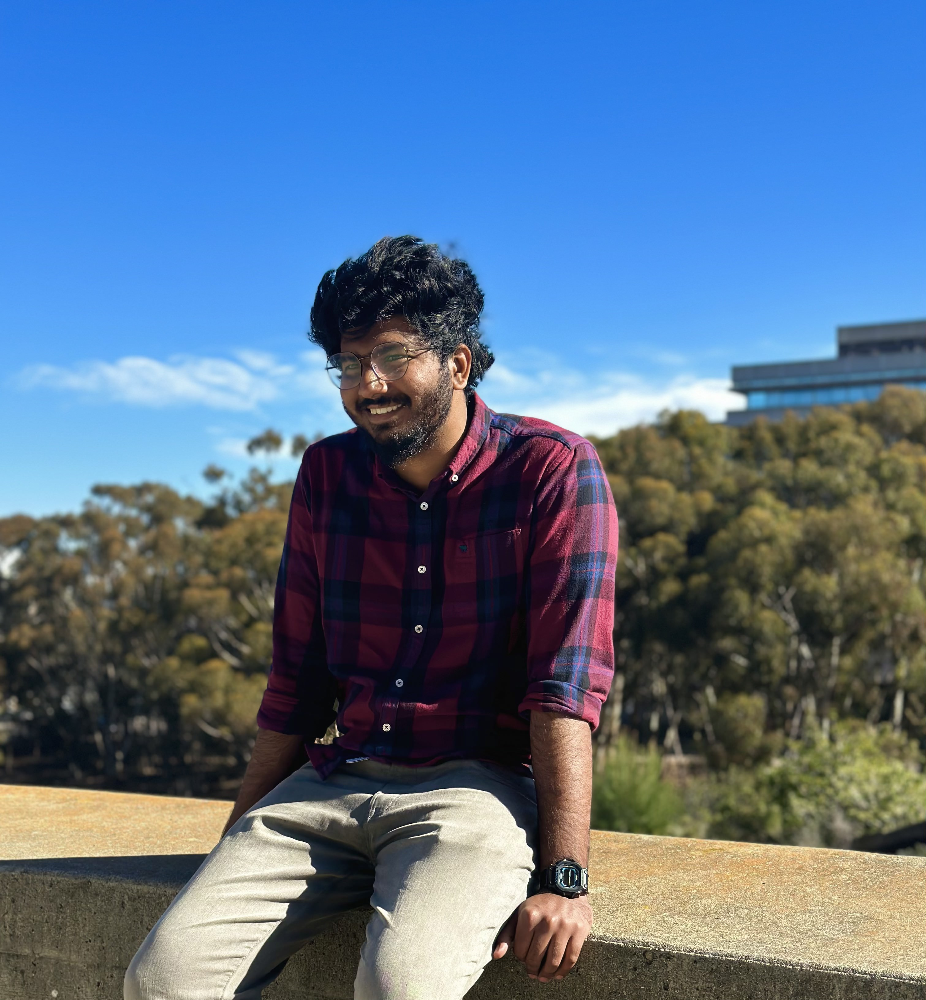

# Abijith Augustine's Web page

## Table of Contents
- [Abijith Augustine's Web page](#abijith-augustines-web-page)
  - [Table of Contents](#table-of-contents)
  - [About Me](#about-me)
  - [Ordered List of my classes this quarter](#ordered-list-of-my-classes-this-quarter)
  - [Unordered List of hobbies](#unordered-list-of-hobbies)
  - [Task List for this week](#task-list-for-this-week)

## About Me

I'm a passionate bioengineer who likes to solve issue using computational tools avaliable. I am a ** 5th** year student majoring in bioengineering:bioinformatics

> I am passionate about finding and solving complex problems

My faourite line of code is;
> My code:
>
>       system.out.println("Hello World")

[My linkedin is ](https://www.linkedin.com/in/abijith-augustine-219555192/)

- **Name:** Abijith Augustine
- **Location:** San Diego, CA Oroginally from  Modesto CA
- **Interests:** Software development, machine learning

## Ordered List of my classes this quarter

1. phys 177
2. phys 139
3. BIMM 101
4. CSE 110 (Waitlisted)
5. MATH 102
6. BENG 187D
7. MATH 109
8. MATH 281C (under easy request)

## Unordered List of hobbies

- food tasting
- mma
- boxing
- driving
- music

## Task List for this week

- [x] Task 1 Lab1 CSE 110(completed)
- [ ] Task 2 Lab 3 BIMM 101 (not completed)
- [ ] Task 3 Lab 1 Phys 139(not completed)

